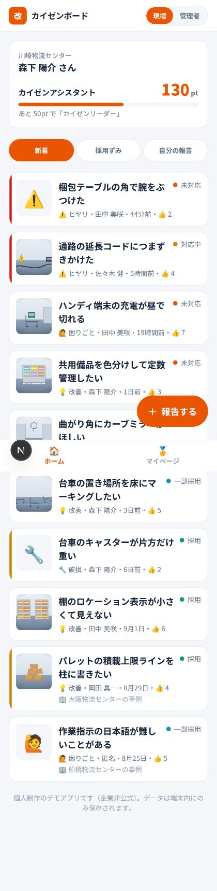
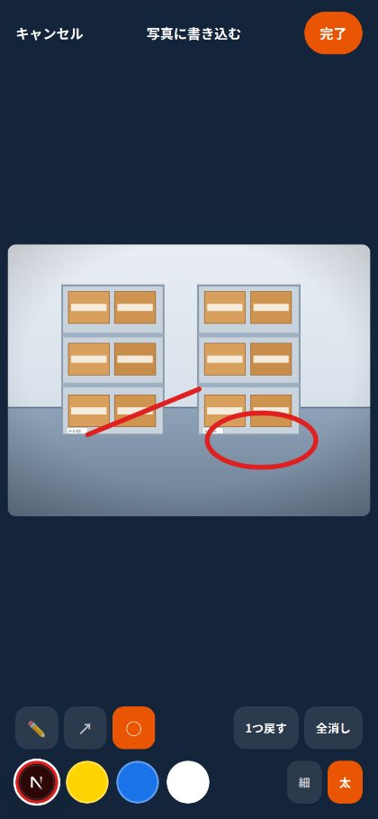
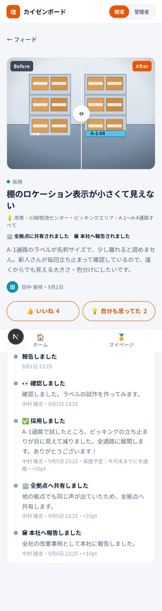
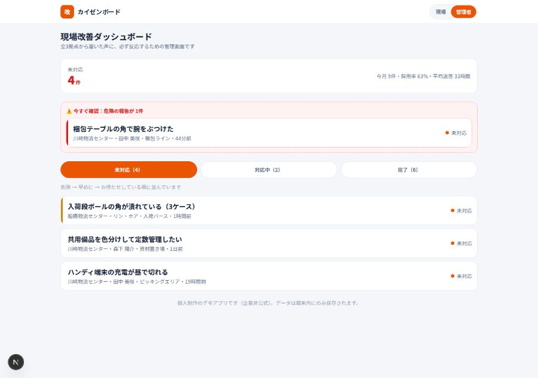
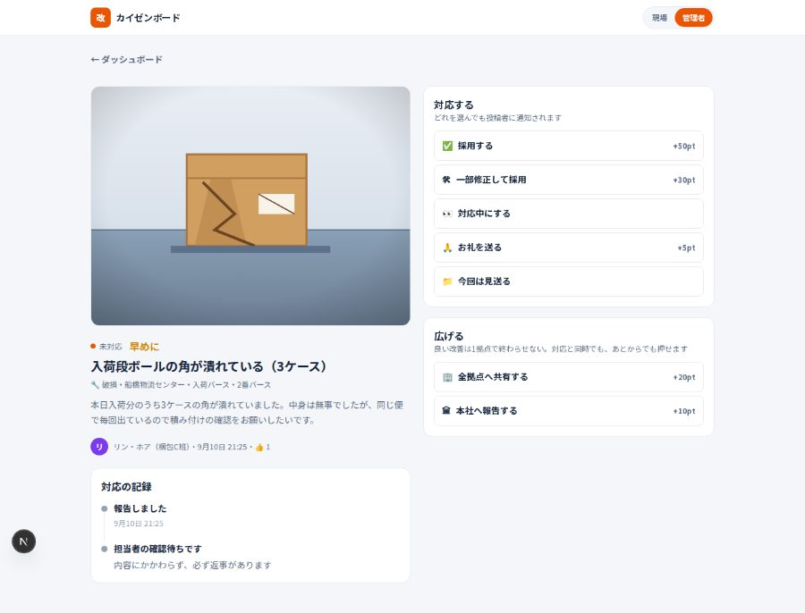

# カイゼンボード（KAIZEN BOARD）

**現場の気づきを、30秒で。返事は、必ず。**

倉庫・ピッキング現場のスタッフが、改善アイデア／破損・不具合／ヒヤリハット／困りごとを
**スマホから写真＋手書きで**共有できる、現場改善報告アプリです。
投稿には内容にかかわらずポイントが付き、管理者は「採用」「一部修正して採用」「お礼」などで**必ず反応**します。
さらに、良い改善は**全拠点・本社へ共有**して1拠点で終わらせません。

> ⚠️ 個人制作のポートフォリオ用デモアプリです。特定の企業とは関係のない非公式の作品で、ロゴ等は使用していません。
> データはブラウザの中だけに保存され、外部には送信されません。

| 現場フィード | 写真に手書き | 報告のその後 |
|---|---|---|
|  |  |  |

| マイページ | 管理者ダッシュボード | 管理者の対応画面 |
|---|---|---|
|  |  |  |

---

## 解こうとしている課題

現場で一番たくさん気づいているのは、そこで働いているスタッフ本人です。
それでも改善が進まないのは、たいてい次の4つが理由でした。

| 課題 | このアプリの答え |
|---|---|
| 報告の手間が大きい | **写真＋手書き＋ひとことで30秒。** 文章が苦手でも、丸と矢印で伝わる |
| 出しても反応がない | **タイムラインで「その後」が見える。** 管理者の対応が投稿に紐づいて残る |
| 採用されないと徒労に終わる | **採否にかかわらずポイントが入る。** 出すこと自体を称える |
| 良い改善が1拠点で終わる | **全拠点・本社へ共有できる。** 横展開されると投稿者にさらにポイント |

## 主な機能

### 現場スタッフ側（スマホ）
- **3ステップの投稿フロー** … ①種類と急ぎ具合 → ②写真と手書き → ③ひとこと
- **写真への手書き注釈** … ペン／矢印／丸、色4種・太さ2種、1つ戻す・全消し（Canvas を自作）
- **Before / After 比較** … ドラッグで見比べられるスライダー（指・マウス・キーボード対応）
- **拠点をまたぐ事例共有** … 自分の拠点の報告に加えて、**他拠点で全拠点共有された事例**が流れてくる
- **ポイントとレベル** … 獲得内訳のアニメーション、レベル、バッジ、今月のランキング
- **匿名投稿** … 名前を出さずに送れる（ポイントはきちんと付く）
- **PWA** … ホーム画面に追加するとアプリとして全画面起動。オフラインでも開ける

### 管理者側（PC / タブレット）
- **開いた瞬間が「未対応」** … 全件ではなく、手を打つべき案件から始まる
- **危険 → 早めに → お待たせしている順** … 緊急度が第一キー、同じ緊急度なら古い順で放置を防ぐ
- **危険な未対応は最上部に警告ブロック** としてまとめて表示
- **5種類の対応** … ✅採用(+50pt) / 🛠一部修正して採用(+30pt) / 👀対応中 / 🙏お礼(+5pt) / 📁見送り（**理由必須**）
- **2種類の共有** … 🏢全拠点へ共有(+20pt) / 🏛本社へ報告(+10pt)。対応と両立し、もう一度押せば解除

### ポイント設計

| 行動 | pt |
|---|---|
| 報告する（内容問わず） | +10 |
| 写真を付ける | +5 |
| After写真も付ける | +10 |
| 採用された | +50 |
| 一部修正して採用された | +30 |
| 管理者からお礼 | +5 |
| **全拠点へ共有された** | **+20** |
| **本社へ報告された** | **+10** |
| 週3件の連続報告ボーナス | +20 |

## さわってみる

```bash
npm install
npm run dev
# http://localhost:3000
```

デモとして次の流れをひととおり体験できます（カメラのないPCでも、投稿画面の
「サンプル写真」から手書き機能を試せます）。

1. フィード右下の「＋ 報告する」から投稿 → ポイント獲得の演出
2. 画面右上の切り替えで**管理者**になり、未対応の案件に「採用」＋「全拠点へ共有」
3. **現場スタッフ**に戻り、マイページのポイント・レベル・バッジが増えているのを確認
4. マイページ下部でログイン中のスタッフを**他拠点の人**に切り替えると、
   共有された改善が事例としてフィードに流れてくる
5. リロードしてもデータは残ります（「デモを初期状態にもどす」で初期化）

## 技術構成

- **Next.js 16（App Router）/ React 19 / TypeScript / Tailwind CSS v4**（追加の依存パッケージなし）
- バックエンドなし。**シードデータ＋ブラウザ内保存**で全機能が動きます
  - 報告などのメタデータ … `localStorage`
  - 投稿写真 … `IndexedDB`（Blob のまま保存。長辺1280pxへ縮小＋JPEG圧縮してから格納）
- 状態管理は `useSyncExternalStore` による自作ストア
- 手書き注釈・画像合成は Canvas API を直接利用（座標は画像サイズに対する比率で保持）
- PWA は Next.js の `manifest.ts` と自前の Service Worker（ナビゲーションは network-first）

```
src/
  app/            ルーティング（/ , /new , /report/[id] , /me , /admin , /admin/[id]）と manifest
  features/       各画面の実体
  components/     PhotoAnnotator, BeforeAfterSlider, Timeline, ReportCard など
  lib/            types / store / storage / points / stats / labels
  data/seed.ts    シードデータ（3拠点・6人・12件の報告）
public/seed/      サンプル写真（SVGイラスト）
```

### バックエンドへの差し替え

データアクセスは `src/lib/store.ts` と `src/lib/storage.ts` に閉じています。
読み出しと `createReport` / `addAdminAction` / `toggleShare` / `toggleReaction` の中身を置き換えるだけで、
Supabase などの実データベースに移行できます
（テーブルは `reports` / `admin_actions` / `reactions` / `users`、画像は Storage を想定）。

## 設計上の判断メモ

- **UIは「引き算」で作る** … 文字サイズは4段階（20 / 16 / 14 / 12px）に限定し、
  強い色（オレンジ）は主ボタンと現在地だけ。ステータスは塗りバッジではなく小さな丸、
  緊急度はカード左端の細い帯。枠線のみ・影なし・角丸1種類で統一し、1カードの要素は4つまで。
- **ポイントは投稿履歴から毎回計算する**（保存しない）。合計値を持たないので、
  共有の解除やルール変更でもズレが起きません。バッジも同じく導出値です。
- **未対応件数を管理画面で最初に、赤で見せる**。放置を仕組みで防ぐための表示です。
- **「見送り」だけコメント必須**。断るときこそ、次の投稿につながる言葉が要るためです。
- **共有はステータスと別軸**にした。「採用」と「全拠点へ共有」は本来別の判断なので、
  ひとつのステータスに混ぜず、どちらも独立して付け外しできるようにしています。
- **画像座標は比率で保持**。端末や表示サイズが変わっても、書き込みの位置がずれません。
